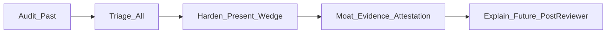

# VetCrew CTO Strategy Roadmap

## Synthesis (skill steps 1–2)

**Mapped spine (concrete paths):**
- Reducer / engine: [`packages/engine/src/reducer.ts`](../../../packages/engine/src/reducer.ts), [`fsm.ts`](../../../packages/engine/src/fsm.ts), [`views.ts`](../../../packages/engine/src/views.ts), [`aar.ts`](../../../packages/engine/src/aar.ts)
- Live Socket.IO: [`server/live/session-room.ts`](../../../server/live/session-room.ts), [`event-append.ts`](../../../server/live/event-append.ts), [`socket.ts`](../../../server/live/socket.ts), [`src/live/useSession.ts`](../../../src/live/useSession.ts)
- ICU web UI: [`src/App.tsx`](../../../src/App.tsx) (Home launcher), [`StationPage.tsx`](../../../src/pages/StationPage.tsx), [`InstructorConsolePage.tsx`](../../../src/pages/InstructorConsolePage.tsx), [`AarPage.tsx`](../../../src/pages/AarPage.tsx), [`ManagerEvidencePage.tsx`](../../../src/pages/ManagerEvidencePage.tsx)
- Append-only log: [`server/db/schema/events.ts`](../../../server/db/schema/events.ts) + migrations `0002`/`0004`; ANTS: [`server/db/schema/scoring.ts`](../../../server/db/schema/scoring.ts) (`evidence_event_seqs` already required)
- Gaps (name as absences): Web Audio missing; design-system `PatientMonitor` / `ConnectionPill` not wired into prod pages; multi-role stations not live-wired; clinical stamp HITL open (#12)

**Integrity claim:** Same seed + append-only `session_events` + pure `replay()` already earns byte-identical recovery and role-attributed evidence.

**Weakest link under ICU load:** Time-to-first-action is Home → REST `createSession` → lazy chunk → Clerk → socket join → wait for `running`. A stressed tech does not clear first useful screen in under ~10s on the trainee create path; Home still exposes create+smoke cognitive load.

**Go/no-go (pitch vs floor scores):**
- Pitch demo / internal: deployable with `VETCREW_ALLOW_UNREVIEWED_SCORES` local/CI only
- Real-person production scores: **HOLD & UPGRADE** until #12 clinical stamp — core risk is scoring unreviewed Scenario #2



---

## Phase A — Audit the past (report only, no fixes)

Run impeccable `/audit` against the shipped ICU surfaces (Station, Instructor, AAR, Manager, Home). Output a scored report (0–4 × a11y / perf / theming / responsive / anti-patterns) with P0–P3 items tied to files.

Expected findings to confirm in the report (from map, not invented):
- **Perf P1:** lazy routes without prefetch before `#/station/:id`; Home still owns trainee session create
- **Theming P2:** tokens imported via [`src/main.css`](../../../src/main.css) but Station vitals/UI largely inline; DS kit unused
- **A11y P2:** reconnect banners use `role="alert"`; vital grid / task panel need keyboard + label pass
- **Responsive P3:** desktop/web is the product — score against ICU desktop, not mobile-first
- **Anti-pattern P1:** dual ConnectionPill (inline in Station vs DS component)

Deliverable: `docs/audits/2026-07-25-icu-surfaces-audit.md` (or canvas if preferred at execution time). Phase B/C consume P0–P1 only.

> **Correction (2026-07-30): Phase A never ran.** `docs/audits/` does not exist. Phase C shipped anyway and claimed to sweep "P0–P1 audit items" — meaning it swept the *expected* findings listed above, not observed ones. Two real defects that a genuine audit would have caught survived to the pitch surfaces:
> - **AAR technical checklist rendered in English** on the Hebrew-first evidence screen — `evaluateChecklist` dropped `labelHe` even though `checklistItemSchema` requires it. Fixed 2026-07-30 (engine carries `labelHe` through; `AarPage` renders it; regression test added).
> - **The patient monitor was unwired** *(state as of the 2026-07-30 audit snapshot, before the fix in this same review)*. The Station's left half was five numeric tiles over a large empty region; the waveform renderer proven in `spikes/webxr/src/monitor.js` was not on the pitch screen. **Resolved 2026-07-30** — ported to `src/monitor/renderer.ts` + `src/components/PatientMonitor.tsx` and wired into `StationPage`, drawing only the channels the engine supplies.
>
> Do not mark Phase A "completed" by inference from Phase C. Either run it or drop it explicitly.

---

## Phase B — Triage all (open tracker)

Tracker today uses Wayfinder labels, not Matt Pocock triage roles. **Decision locked for execution:** add GitHub labels `needs-triage`, `needs-info`, `ready-for-agent`, `ready-for-human`, `bug`, `enhancement` (keep Wayfinder labels for map/grilling). Every posted comment starts with the triage disclaimer.

| Item | Category | State | Rationale |
|---|---|---|---|
| [#12](https://github.com/exposwifty31/VetCrew/issues/12) Clinical stamp | enhancement | **paused-pivot** | Pitch shelved 2026-07-30; stamp remains HITL when pitch resumes; `VETCREW_ALLOW_UNREVIEWED_SCORES` is CI/local-only (never production) |
| [#10](https://github.com/exposwifty31/VetCrew/issues/10) SRS Option (a) countersign | enhancement | **paused-pivot** | Pitch shelved; Option (a) still the active scenario posture when work resumes |
| [#9](https://github.com/exposwifty31/VetCrew/issues/9) Wayfinder map | enhancement | **paused-pivot** | Pitch shelved; close when pitch-readiness checklist resumes |
| [PR #16](https://github.com/exposwifty31/VetCrew/pull/16) Mountain C memo | documentation | **done (merged)** | `f5c528c` |

Triage labels applied 2026-07-26. Phase C → [#17](https://github.com/exposwifty31/VetCrew/pull/17). Phase D → [#18](https://github.com/exposwifty31/VetCrew/pull/18).

---

## Phase C — Harden the present = THE WEDGE

**Exactly one wedge: Floor deep-link station entry (trainee never creates).**

Stressed tech opens a single assigned URL (`#/station/:sessionId`), lands on vitals/tasks with connection honesty, no Home create form, no smoke-demo clutter on the critical path.

Build from current React/Vite + Socket.IO:

1. **Instructor-owned create** — Home “Start station” becomes instructor-only (role gate already exists); trainee path is join-by-URL / open recent assigned link from `role_stations`.
2. **Prefetch** — on instructor create success (and on Home when instructor), `import("./pages/StationPage.js")` so trainee deep-link skips Suspense tax.
3. **Station first-paint harden** — keep interactive intents gated on `phase === "running"`; surface `lastReject` + reconnect `role="alert"` with Hebrew i18n; truncate long scenario/species strings; wire DS [`ConnectionPill`](../../../design-system/components/status/ConnectionPill.jsx) (or extract shared component) so reconnect never reads as live.
4. **Optional copy affordance** — Instructor console “Copy station link” button (clipboard) — zero new backend.

Sketch (tied to real modules):

```ts
// src/App.tsx — instructor create only; prefetch station chunk
void import("./pages/StationPage.js");
window.location.hash = `#/station/${session.id}`;

// src/live/useSession.ts — already rejoins with lastSeq; keep clearing
// roleView on disconnect so UI cannot show stale vitals as live
```

Harden pass also sweeps P0–P1 audit items on Station/Instructor only (overflow, 401/403 copy, RTL long strings). No mobile redesign. No Web Audio in this phase.

---

## Phase D — Moat = evidence attestation (not verdicts)

**Exactly one moat: Tamper-evident ANTS evidence binding at rating time.**

Schema already requires `evidence_event_seqs` on [`ants_ratings`](../../../server/db/schema/scoring.ts). Gap: no server proof those seqs exist in the session log, and no frozen log head for later challenge.

Implement:

1. Migration `0006_evidence_attestation.sql` — add `log_head_seq int not null`, `log_head_hash text not null` on `vc_ants_ratings`.
2. In rating POST ([`server/routes/sessions.ts`](../../../server/routes/sessions.ts)): inside a TX, verify every evidence seq exists for `session_id`; compute `sha256` over ordered `(seq,type,role,actor_id,payload)` rows up to current head; store head seq+hash with the rating; reject empty/unknown seqs.
3. Manager read path ([`server/routes/manager.ts`](../../../server/routes/manager.ts)): return attestation fields; UI shows “evidence bound to log head N” — never a readiness band.
4. Vitest: append events → rate with valid seqs → ok; rate with phantom seq → 400; mutate-attempt still blocked by append-only triggers.

Sketch:

```ts
async function attestEvidence(tx, sessionId, seqs: number[]) {
  const rows = await loadEvents(tx, sessionId);
  const bySeq = new Map(rows.map((r) => [r.seq, r]));
  for (const s of seqs) if (!bySeq.has(s)) throw new AttestError("unknown_seq");
  const head = rows[rows.length - 1];
  return { logHeadSeq: head.seq, logHeadHash: hashChain(rows) };
}
```

This hardens the evidence product competitors cannot casually copy; it does not ship hiring auto-verdicts.

---

## Phase E — Explain the future (doctrine, not build yet)

> **Superseded for execution (2026-08-01 founder review).** Pitch track is shelved; worktree infra (#23) shipped; current milestone is **product work** per root `CLAUDE.md`. Do not treat this phase as the next agent task. The forward claims below remain true when the pitch resumes — they are dormant, not cancelled.

Write a short forward brief (repo doc or pitch appendix) that states:

- **Ship one rung** until Reviewer approves; mountain remains vision ([`mountain-decision-memo.md`](../../decisions/mountain-decision-memo.md)).
- After Reviewer + #12 stamp: build-order step 3 polish complete → step 4 full crew + partial views live-wired ([`packages/engine/src/views.ts`](../../../packages/engine/src/views.ts) already supports asymmetry).
- Scoring surfaces stay within-person trends; three-rater / async replay for anything consequential.
- Re-entry gates unchanged: voice (Nova-3 Hebrew benchmark), WebXR only on ADR-001 triggers, no ML scores.
- Split-engine (Alpha stepped / Beta tick) only if summit work starts — not a wedge rewrite.

No engine code in Phase E.

---

## Execution order and exit criteria

1. Phase A audit report committed
2. Phase B triage labels + comments on #9/#10/#12 (PR #16 closed/merged — skip)
3. Phase C wedge PR (trainee deep-link + prefetch + ConnectionPill + harden)
4. Phase D moat PR (attestation migration + rating gate + manager fields + tests)
5. Phase E future brief

**Done when:** CTO output-template sections are filled in the roadmap doc (wedge + moat specs above), go/no-go names clinical #12 as core risk, and next three actions are:
1. Modify [`src/App.tsx`](../../../src/App.tsx) / [`StationPage.tsx`](../../../src/pages/StationPage.tsx) for deep-link wedge
2. Vitest: ANTS rating rejects unknown `evidence_event_seqs`
3. Railway: keep `VETCREW_ALLOW_UNREVIEWED_SCORES` unset in prod; stamp Scenario #2 only via Reviewer (#12)
