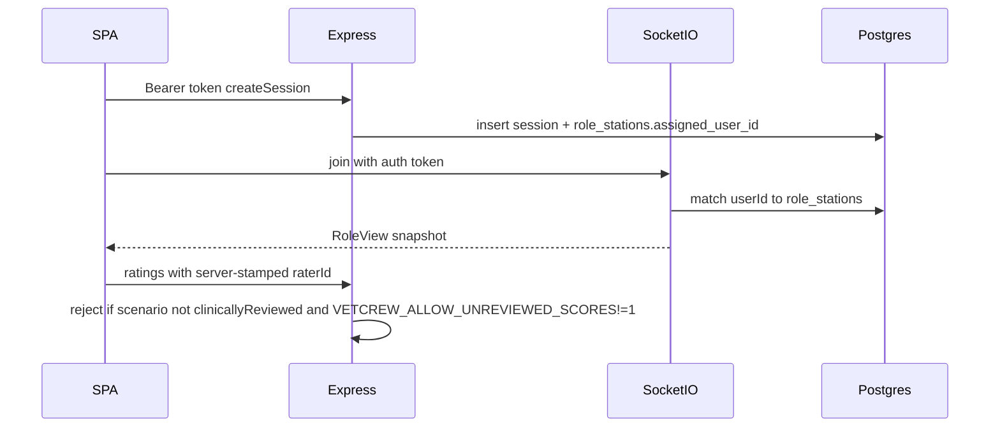

# Tech Debt E2E Closeout Implementation Plan

> **For agentic workers:** REQUIRED SUB-SKILL: Use superpowers:subagent-driven-development (recommended) or superpowers:executing-plans to implement this plan task-by-task. Steps use checkbox (`- [ ]`) syntax for tracking.

**Goal:** Close all Phase 1–2 tech debt from the post-[#14](https://github.com/exposwifty31/VetCrew/pull/14) audit so pitch surfaces work under real auth, stay evidence-not-verdict, and are proven by Playwright E2E (plus harden/optimize/quality gates on touched UI).

**Architecture:** Keep the event-sourced sim core pure. Auth is a thin shell: Clerk (or CI test-bearer) stamps identity; `role_stations.assigned_user_id` is the join allowlist; REST ownership + `publicMetadata.vetcrewRole` gate manager/instructor actions. Unreviewed scenarios remain stampable only by a human — code only *gates* scoring, never sets `clinically_reviewed=true`.

**Tech Stack:** TypeScript, Express, Socket.IO, Clerk (`@clerk/express` / `@clerk/react`), Drizzle/Postgres, Vite/React, Playwright + axe, Vitest.

## Global Constraints

- No hiring / “ready for the floor” verdict language (CLAUDE.md §2.2).
- No `clinically_reviewed=true` without a named real reviewer (CLAUDE.md §2.5) — Task 6 gates only.
- Reducer stays pure: no `Date.now()` / `Math.random()` / I/O inside engine.
- Hebrew-first UI; all new strings through i18n; WCAG 2.1 AA (axe serious/critical = fail).
- `tsx` remains dev-only; prod start stays `node dist-server/index.js`.
- Out of scope: full-crew multi-station, esbuild server bundle, Dependabot/coverage dashboards (optional follow-up), inventing Option (a) clinical content.

**Locked provisional role model** (closes wayfinder [#11](https://github.com/exposwifty31/VetCrew/issues/11) for engineering; Dan can rename later):

```ts
type VetcrewRole = "manager" | "instructor" | "trainee";
// Clerk user.publicMetadata.vetcrewRole
```

**Locked CI auth seam** (Clerk-on path without real Clerk secrets in GitHub Actions):

```ts
// Only when process.env.VETCREW_TEST_AUTH === "1" (CI/e2e never production)
// Authorization: Bearer test:<userId>:<vetcrewRole>
```



## File map

| File | Responsibility |
|------|----------------|
| [`server/auth.ts`](server/auth.ts) | `requireSignedIn`, `requireRole`, test-bearer reader |
| [`server/live/socket.ts`](server/live/socket.ts) | Clerk/test auth on join; bind `actorId` from station |
| [`server/routes/sessions.ts`](server/routes/sessions.ts) | Ownership checks; stamp `raterId`; unreviewed score gate; assign stations |
| [`server/routes/manager.ts`](server/routes/manager.ts) | `requireRole("manager")`; batch event load (kill N+1) |
| [`server/scenarios.ts`](server/scenarios.ts) | Upsert scenario rows (review flags can update) |
| [`src/hooks/useBearerToken.ts`](src/hooks/useBearerToken.ts) | Existing; extend for socket auth |
| [`src/live/useSession.ts`](src/live/useSession.ts) / [`useInstructorSession.ts`](src/live/useInstructorSession.ts) | Pass auth; drop hardcoded `dev-*` actorIds in prod |
| [`src/components/AuthBar.tsx`](src/components/AuthBar.tsx) | Shared chrome on all authenticated pages |
| [`src/App.tsx`](src/App.tsx) | Lazy-load station/instructor/AAR/manager routes |
| [`e2e/*.spec.ts`](e2e/) | Home, station, instructor live, manager, authz, a11y |
| [`playwright.config.ts`](playwright.config.ts) / [`.github/workflows/ci.yml`](.github/workflows/ci.yml) | `VETCREW_TEST_AUTH=1` for e2e |
| [`CLAUDE.md`](CLAUDE.md), [`README.md`](README.md), [`.env.example`](.env.example) | Docs + Railway Vite key |
| [`docs/superpowers/plans/2026-07-25-tech-debt-e2e-closeout.md`](docs/superpowers/plans/2026-07-25-tech-debt-e2e-closeout.md) | This plan (write on execution start) |

---

### Task 1: Test-auth seam + role helpers (TDD)

**Files:**
- Modify: [`server/auth.ts`](server/auth.ts)
- Create: [`server/test/auth-roles.test.ts`](server/test/auth-roles.test.ts)
- Modify: [`.env.example`](.env.example), [`server/env.ts`](server/env.ts) if present

**Interfaces:**
- Produces: `AuthSnapshot { isAuthenticated, userId, role: VetcrewRole | null }`, `readAuth(req)`, `requireSignedIn(enabled)`, `requireRole(role, enabled)`, `parseTestBearer(header)`

- [ ] **Step 1: Failing tests** for test bearer parse + `requireRole("manager")` → 403 for trainee

```ts
test("test bearer parses userId and role when VETCREW_TEST_AUTH=1", () => {
  process.env.VETCREW_TEST_AUTH = "1";
  expect(parseTestBearer("Bearer test:user-1:manager")).toEqual({
    isAuthenticated: true,
    userId: "user-1",
    role: "manager",
  });
});
```

- [ ] **Step 2: Implement** dual reader: if `VETCREW_TEST_AUTH===\"1\"` and bearer matches `^test:([^:]+):(manager|instructor|trainee)$`, use it; else Clerk `getAuth` + `sessionClaims`/`publicMetadata.vetcrewRole`.
- [ ] **Step 3: Pass tests** — `pnpm exec vitest run server/test/auth.test.ts server/test/auth-roles.test.ts`
- [ ] **Step 4: Commit** `feat(auth): test bearer and role helpers for CI`

---

### Task 2: Session create binds `role_stations` + REST ownership

**Files:**
- Modify: [`server/routes/sessions.ts`](server/routes/sessions.ts)
- Modify: [`server/index.ts`](server/index.ts) (pass auth reader)
- Modify: [`server/test/integration.test.ts`](server/test/integration.test.ts), [`server/test/auth.test.ts`](server/test/auth.test.ts)

**Interfaces:**
- Consumes: `readAuth` from Task 1
- Produces: on `POST /api/sessions`, set `role_stations.assigned_user_id` for `technician` ← `traineeId` (must equal authed `userId` unless role is `instructor`/`manager` creating for a named trainee); instructor station ← creator `userId` when role is instructor/manager

- [ ] **Step 1: Failing tests** — unsigned 401 (already); trainee cannot create session for another `traineeId` (403); instructor can; `GET /api/sessions/:id/aar` 403 if caller not assigned and not manager/instructor.
- [ ] **Step 2: Implement** ownership helper `assertSessionAccess(db, sessionId, auth)`.
- [ ] **Step 3: Stamp `raterId` from `auth.userId`** on ratings POST — ignore client `raterId` when auth enabled (keep body field optional for backward compat in test-auth off).
- [ ] **Step 4: Integration green** — `pnpm test:integration`
- [ ] **Step 5: Commit** `feat(sessions): bind role_stations and enforce REST ownership`

---

### Task 3: Live join auth + drop client-trusted actorId

**Files:**
- Modify: [`server/live/socket.ts`](server/live/socket.ts), [`server/index.ts`](server/index.ts)
- Modify: [`src/live/useSession.ts`](src/live/useSession.ts), [`src/live/useInstructorSession.ts`](src/live/useInstructorSession.ts)
- Modify: [`server/test/socket-authz.test.ts`](server/test/socket-authz.test.ts), [`server/test/socket.test.ts`](server/test/socket.test.ts)

**Interfaces:**
- Socket handshake `auth: { token: string }`
- Join succeeds only if `role_stations` row matches `(sessionId, role, assignedUserId=userId)` OR (`allowDevBypass` and no Clerk/test auth)
- Server sets socket `actorId` from `userId`, never from join payload when auth on

- [ ] **Step 1: Failing test** — `allowDevBypass:false` + test token for unbound user → reject `auth`; bound user → snapshot.
- [ ] **Step 2: Implement** socket middleware reading token → `readAuthFromToken`; wire clients to pass `getToken()` / test bearer.
- [ ] **Step 3: Keep `allowDevBypass: NODE_ENV==='development' && !clerkEnabled && !testAuth`** so existing unit tests with bypass still work; CI e2e uses test auth with bypass off.
- [ ] **Step 4: Commit** `feat(live): authenticate socket join via role_stations`

---

### Task 4: Manager role gate + N+1 kill

**Files:**
- Modify: [`server/routes/manager.ts`](server/routes/manager.ts)
- Modify: [`server/test/manager.test.ts`](server/test/manager.test.ts)
- Modify: [`server/index.ts`](server/index.ts) — `requireRole("manager")` after `requireSignedIn`

- [ ] **Step 1: Failing tests** — trainee token → 403 on `/api/trainees/:id/evidence`; manager → 200; batch-load events with `inArray(sessionId, ids)` once.
- [ ] **Step 2: Implement** role middleware + single query for all session events keyed by sessionId.
- [ ] **Step 3: Commit** `feat(manager): require manager role and batch evidence queries`

---

### Task 5: Scenario upsert + unreviewed scoring gate

**Files:**
- Modify: [`server/scenarios.ts`](server/scenarios.ts)
- Modify: [`server/routes/sessions.ts`](server/routes/sessions.ts) ratings (+ optional create)
- Modify: [`server/test/integration.test.ts`](server/test/integration.test.ts)
- Modify: [`docs/decisions/scenario-srs-divergence-memo.md`](docs/decisions/scenario-srs-divergence-memo.md) — record Option (a) as **accepted for pitch** (closes engineering side of [#10](https://github.com/exposwifty31/VetCrew/issues/10); no clinical stamp)
- Env: `VETCREW_ALLOW_UNREVIEWED_SCORES=1` for local/CI pitch demos; **unset/false in production Railway** so ratings on unreviewed scenarios return 403 `{ error: "scenario_not_clinically_reviewed" }`

- [ ] **Step 1: Failing tests** — sync updates `clinicallyReviewed` when JSON changes; ratings 403 when unreviewed and allow-flag off; 201 when flag on.
- [ ] **Step 2: Implement** upsert on `(tenantId, slug, version)`; gate ratings (and document that create stays allowed for internal practice).
- [ ] **Step 3: Do not flip scenario JSON to `clinicallyReviewed: true`** — leaves [#12](https://github.com/exposwifty31/VetCrew/issues/12) as HITL for the Reviewer.
- [ ] **Step 4: Commit** `feat(scenarios): upsert sync and gate unreviewed scores`

---

### Task 6: UI harden — AuthBar, 401/empty states, i18n

**Files:**
- Modify: [`src/components/AuthBar.tsx`](src/components/AuthBar.tsx), [`src/App.tsx`](src/App.tsx), [`src/pages/ManagerEvidencePage.tsx`](src/pages/ManagerEvidencePage.tsx), [`src/pages/AarPage.tsx`](src/pages/AarPage.tsx), [`src/pages/StationPage.tsx`](src/pages/StationPage.tsx), [`src/pages/InstructorConsolePage.tsx`](src/pages/InstructorConsolePage.tsx)
- Modify: [`src/i18n/he.json`](src/i18n/he.json), [`src/i18n/en.json`](src/i18n/en.json)

**Harden checklist (impeccable/harden):**
- Shared `AppChrome` with `AuthBar` on home/manager/AAR (station/instructor keep instrument chrome but show compact sign-in / reject banner).
- Distinct copy for 401 vs 403 vs network error (`auth.required`, `auth.forbidden`, `shell.networkError`).
- RTL: long Hebrew on manager cards — `overflow-wrap: anywhere`, `min-width: 0` on flex children.
- Station `lastReject` already exists — map codes to i18n.

- [ ] **Step 1: Add i18n keys** + parity check `pnpm i18n:check`
- [ ] **Step 2: Wire chrome + error states**
- [ ] **Step 3: Commit** `fix(ui): harden auth chrome and error/empty states`

---

### Task 7: Optimize — route lazy-load + manager payload

**Files:**
- Modify: [`src/App.tsx`](src/App.tsx) — `React.lazy` + `Suspense` for `StationPage`, `InstructorConsolePage`, `AarPage`, `ManagerEvidencePage`
- Verify Task 4 batching reduced manager API work

**Optimize checklist:**
- Confirm `pnpm build` main chunk drops below prior ~504KB gzip warning where possible (lazy routes).
- No new animation thrash; Suspense fallback is a single i18n “loading” line (no skeleton card farm).

- [ ] **Step 1: Lazy routes + fallback**
- [ ] **Step 2: `pnpm build` and note chunk sizes in commit body**
- [ ] **Step 3: Commit** `perf(web): lazy-load station instructor AAR manager routes`

---

### Task 8: Playwright E2E suite closes the debt

**Files:**
- Create: [`e2e/helpers/auth.ts`](e2e/helpers/auth.ts) — `testBearer(userId, role)`, `authHeaders`
- Create: [`e2e/station-flow.spec.ts`](e2e/station-flow.spec.ts)
- Create: [`e2e/instructor-live.spec.ts`](e2e/instructor-live.spec.ts)
- Create: [`e2e/manager-evidence.spec.ts`](e2e/manager-evidence.spec.ts)
- Create: [`e2e/authz.spec.ts`](e2e/authz.spec.ts)
- Modify: [`e2e/instructor-flow.spec.ts`](e2e/instructor-flow.spec.ts) — use test bearer; keep AAR rating path
- Modify: [`playwright.config.ts`](playwright.config.ts) — webServer env `VETCREW_TEST_AUTH=1`, `VETCREW_ALLOW_UNREVIEWED_SCORES=1`
- Modify: [`.github/workflows/ci.yml`](.github/workflows/ci.yml) — same env on e2e job; set `NODE_ENV=development` for server but test auth forces real binding (bypass off when test auth on)

**E2E coverage matrix:**

| Spec | Proves |
|------|--------|
| `authz.spec.ts` | trainee 403 manager; unbound join rejected; bound join ok |
| `station-flow.spec.ts` | create stepped-tasks → `#/station/:id` → connected RoleView → complete one task |
| `instructor-live.spec.ts` | instructor join → inject/pause → axe |
| `manager-evidence.spec.ts` | manager lists evidence + internal badge; axe |
| `instructor-flow.spec.ts` | AAR rate with server-stamped rater; axe |

- [ ] **Step 1: Write failing e2e specs**
- [ ] **Step 2: Run** `pnpm test:e2e` until green
- [ ] **Step 3: Commit** `test(e2e): cover station instructor manager and authz paths`

---

### Task 9: Ops docs + Railway Vite key + CLAUDE.md sync

**Files:**
- Modify: [`CLAUDE.md`](CLAUDE.md) §5/§6 status (station/instructor/manager shipped; open: clinical stamp HITL, full crew)
- Modify: [`README.md`](README.md) — document `VETCREW_TEST_AUTH`, `VETCREW_ALLOW_UNREVIEWED_SCORES`, Railway **build** var `VITE_CLERK_PUBLISHABLE_KEY`
- Modify: [`railway.json`](railway.json) — comment in README only (Railway vars are console); note RAILPACK is canonical, Dockerfile is backup
- Close/comment wayfinder [#11](https://github.com/exposwifty31/VetCrew/issues/11) with provisional role model; leave [#12](https://github.com/exposwifty31/VetCrew/issues/12) open for Reviewer

- [ ] **Step 1: Docs edits**
- [ ] **Step 2: Commit** `docs: sync CLAUDE/README for auth-bound pitch path`

---

### Task 10: verify-quality gate on touched paths

- [ ] **Step 1: Run** `node "/Users/dan/.claude/skills/ccg/run_skill.js" verify-quality server/src e2e` (or skill path equivalent) and fix High findings in files this plan touched (`StationPage.tsx` length may warn — only split if new code pushes complexity; do not drive-by rewrite).
- [ ] **Step 2: Full CI locally** — `pnpm typecheck && pnpm test && pnpm test:integration && pnpm test:e2e && pnpm build`
- [ ] **Step 3: Final commit if fixes** `chore: address verify-quality on debt closeout`
- [ ] **Step 4: Open PR → green → merge**

---

## Self-review (coverage)

| Audit item | Task |
|------------|------|
| Prod live join / role_stations | 2, 3 |
| Manager any-signed-in | 4 |
| Vite Clerk bake-at-build docs | 9 |
| Unreviewed scenarios / no fake stamp | 5 |
| Client raterId/actorId | 2, 3 |
| Session REST IDOR | 2 |
| Scenario sync insert-only | 5 |
| E2E gaps / Clerk-on CI | 1, 8 |
| CLAUDE.md stale | 9 |
| Option (a) countersign eng close | 5 |
| Clerk role model | 1–4 (provisional) |
| Clinical stamp HITL | deferred (#12) |
| Manager N+1 | 4 |
| AuthBar / harden | 6 |
| Bundle lazy-load | 7 |
| Dual deploy clarity | 9 |
| Full crew | out of scope |

## Execution handoff

After approval, save a copy to `docs/superpowers/plans/2026-07-25-tech-debt-e2e-closeout.md` and choose:

1. **Subagent-Driven (recommended)** — fresh subagent per task + review between tasks
2. **Inline Execution** — executing-plans in this session with checkpoints
